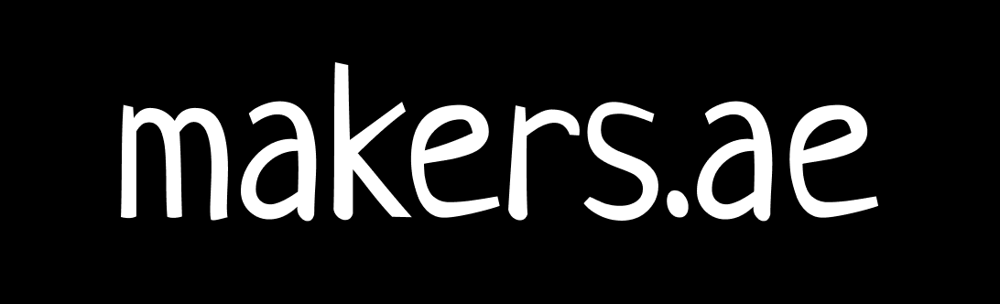

<p align="center">
  
  <p align="center">Community of developers and designers in UAE<p>
  <p align="center">
    <a href="https://makers.ae/#members">
    	
    </a>
    <a href="https://discord.gg/GQjdb3HEJ5">
    	
    </a>
    <a href="https://makers.ae/join">
    	
    </a>
  </p>
</p>

[makers.ae](https://makers.ae) is the community of developers and designers in UAE focusing on open-source, practical knowledge, tech culture, career growth and connecting the developers.

## Why Join Us?

There are some really talented developers and designers in the region but unlike Europe or US, the community isn't really strong here in UAE. With makers.ae our aim is to bring all the makers of the region together under one umbrella and to facilitate growth.

The project is fully open-source, there is no fees or any hidden agendas. Goal is to empower the makers in the region.

* Join [our discord](https://discord.gg/3BGu7UFCaU) to get connected with other makers in the region
* Bi-weekly sessions on interesting topics.
* Learn about the tech stack and how the companies in the region are working.
* Find yourself a mentor, ask for advice..
* Interviews with the tech leaders.
* Subscribe to our [weekly newsletter](https://makers.ae/join) and stay upto date with the tech updates about the region.

## Development

Clone the repository, install the dependencies and start the application

```bash
git clone https://github.com/kamranahmedse/makers.ae
yarn install
yarn dev
```

## FAQs

Feel free to open an issue if there is something that we haven't covered.

### Who can join?
The only requirement to join the community is to be a maker. You can either be a developer, a designer or a student.

### Do you organize meetups?
Yes, we have bi-weekly meetups from the community members as well as external contributors on a variety of topics. All our sessions are done via Zoom call and are open for anyone to join.

### Can I give a talk?
Yes! We are constantly looking for contributors, reach out to us via email or on Discord and let's make it happen.

### Do you have a Slack or Discord?
Yes, once you register, we will send you an invite to our Discord community, where you can talk to other makers in the region.

### What's in the newsletter?
We have a bi-weekly newsletter where we share general tech updates as well as updates from the region, job openings and upcoming events.

### Can I invite my friends?
For sure. We aim to create the biggest online community of developers in the region so we would love for you to invite your friends and colleagues.

### How is this website built?
The website is OpenSource, it is built with Next.js and is hosted on GitHub pages. Feel free to have a look at the code and send any contributions our way.

### Can I contribute to the project?
Yes, apart from being a part of community events, spreading the word, and inviting your friends, you can also contribute to the code. We are open for anyone to suggest, discuss and contribute to the code.


## Contributions
- Report issues.
- Open pull request with improvements
- Spread the word
- Reach out with any feedback [](https://twitter.com/kamranahmedse)

